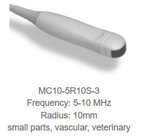
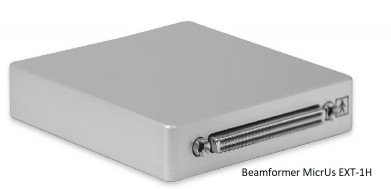

# STAR-Ultrasound

The Ultrasound model is MicrUs EXT-1H Ultrasound from TELEMED http://www.pcultrasound.com/products/products_micrus/ 
MicrUS is a pocket-sized ultrasound imaging system. 
The ultrasound imaging system consists of the Micrus EXT-1H bearmformer and the ultrasound transducers MC10-5R10S-3 and L15-6L25S-3.

## Installation of the Ultrasound system

Instructions for the installation of the ultrasound in a windows computer are found in the beamformer manual MicrUs.pdf (TELEMED-software/MicrUs.pdf). 

## Install TELEMED drivers and Echo Wave II

Make sure the beamformer is disconnected from the computer!
- Install the TELEMED drivers using the executable TELEMEd-software/telemed.exe.
- After the installation connect the beamformer to the computer using the USB cable (don't connect to power or to transducer). The orange end connects to the ultrasound and the other end of the USB cable connects to the computer.
- Wait until windows finds the drivers for the ultrasound, it should recognize the de device MircUS.

- Then use the executable TELEMEd-software/telemed.exe to install the software EchoWave II.
- The Echo Wave II icon will appear at the desktop after installation;
- Connect the power cable and the probe;
- Double click on Echo Wave II to start the software and make sure that the ultrasound is working correctly

Neves disconnect the USB or power cable during scan mode, it can damage the beamformer and transducers, first exit any software using the ultrasound and then disconnect.

Additional information for the operation of the ultrasound using the propietary software from telemed is found in the manual of Echo Wave II (TELEMED-software/Echo WaveII/EchoWaveII_Software_User_Manual.pdf).

Installed Usgfw2 SDK redistributable files (usgfwsetup.exe) (SDK manual)
Install splitcam driver version 7.7.4.1

# STAR ULTRASOUND APP

## Intalation
Download and copy the contents of the folder on the local computer.

1. Register the filter Cam.dll

Open a windows command as administration.
    Windows+R
    type "Run" on the box
    press Ctrl+Shift+Enter to run the command as administrator
Navigate to the location of the folder.
    Example if the folder is located on the desktop type:
    $ cd C:\Users\user\Desktop\STAR_ultrasound_app
Register the Directshow filter Cam.dll, run on the command line:
    $ regsvr32 Cam.dll
    This will only need ot be configured once
2. Run the application sample.exe
    It should open a window displaying the ultrasound image.
    Exit the application 
    Never disconnect the ultrasound transducer or power during scaning mode, always close applications firts!

4. Install the pluging splitcam using the executable located in the main folder STAR_ultrasound_app.

5. Open splitcam and select as source the filter "PushSource sender filter"
 
6. Run the application sample.exe
    Splitcam should render the live image of the ultrasound.

## Use the ultrasound application

1. Make sure the Ultrasound is connected to power and the computer.
2. Run the application sample.exe
3. Make sure splitcam is running (on the background) on your computer with the filter Pushsource selected.
3. Open a web broser with the following URL:
https://purduestarproj-webrtc-example.herokuapp.com/?user=star-ultrasound&name=Star-ultrasound

Once the STAR Mentor starts the connection select the "camera device" on the browser app (splitcam video driver). 
Now ultrasound image is streamed to the Mentor system.

Trouble shooting
- Make sure the pushsource filter  is selected in the splitcam application
    (repeat step 5).
- If you repeat step 1 after installation make sure the app splitcam is closed during this step and end the task in the task manager.
- Make sure the folder C:\Users\Public exists on your computer.

