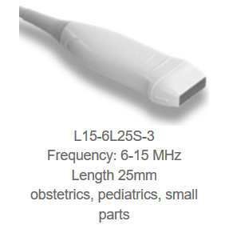

# STAR-Ultrasound

The Ultrasound model is MicrUs EXT-1H Ultrasound from TELEMED http://www.pcultrasound.com/products/products_micrus/ 
MicrUS is a pocket-sized ultrasound imaging system. 
The ultrasound imaging system consists of the Micrus EXT-1H bearmformer and the ultrasound transducers MC10-5R10S-3 and L15-6L25S-3.

## Installation of the Ultrasound system

Instructions for the installation of the ultrasound in a windows computer are found in the beamformer manual MicrUs.pdf (TELEMED-software/MicrUs.pdf). 

## Install TELEMED drivers and Echo Wave II

Make sure the beamformer is disconnected from the computer!
- Install the TELEMED drivers using the executable TELEMEd-software/telemed.exe.
- After the installation connect the beamformer to the computer using the USB cable (don't connect to power or to transducer). The orange end connects to the ultrasound and the other end of the USB cable connects to the computer.
- Wait until windows finds the drivers for the ultrasound, it should recognize the de device MircUS.

- Then use the executable TELEMEd-software/telemed.exe to install the software EchoWave II.
- The Echo Wave II icon will appear at the desktop after installation;
- Connect the power cable and the probe;
- Double click on Echo Wave II to start the software and make sure that the ultrasound is working correctly

Neves disconnect the USB or power cable during scan mode, it can damage the beamformer and transducers, first exit any software using the ultrasound and then disconnect.

Additional information for the operation of the ultrasound using the propietary software from telemed is found in the manual of Echo Wave II (TELEMED-software/Echo WaveII/EchoWaveII_Software_User_Manual.pdf).

Installed Usgfw2 SDK redistributable files (usgfwsetup.exe) (SDK manual)
Install splitcam driver version 7.7.4.1

 
